### 💻 Gabriel de Souza

**`Developer Front-End`**

Me chamo Gabriel de Souza, tenho 20 anos e sou natural de Rio Grande do Sul. Atualmente cursando Análise e Desenvolvimento de Sistemas (ADS) pela Universidade de Caxias do Sul (UCS).

---

### 💡 Linguagens e Tecnologias

    
    
    
    
    
    
     

---

### 📊 Estátisticas

    

### GitHub Stats

